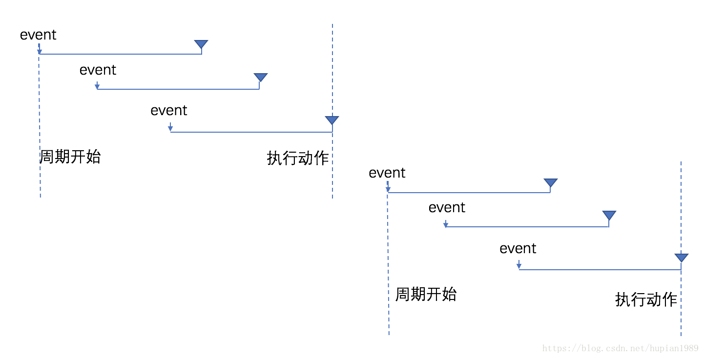
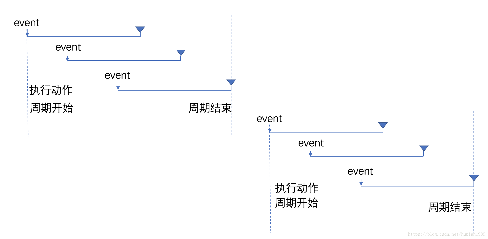
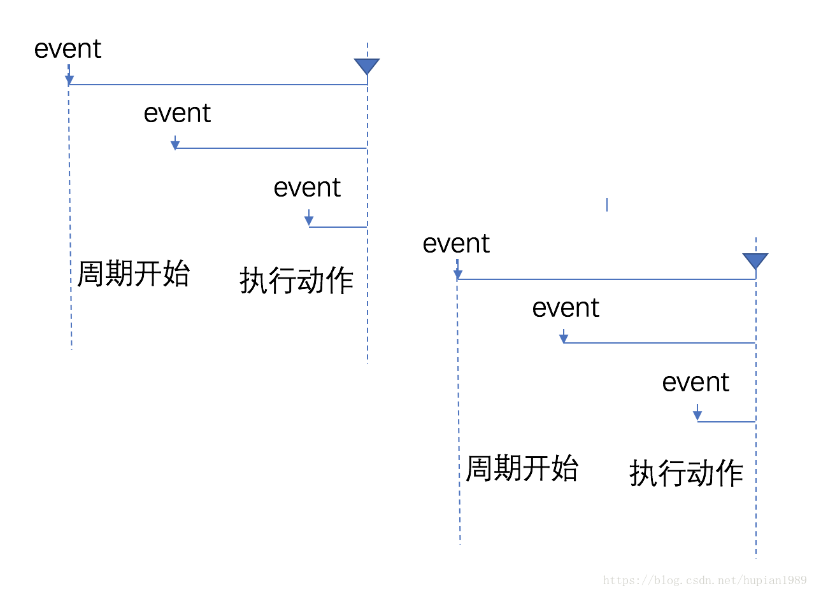
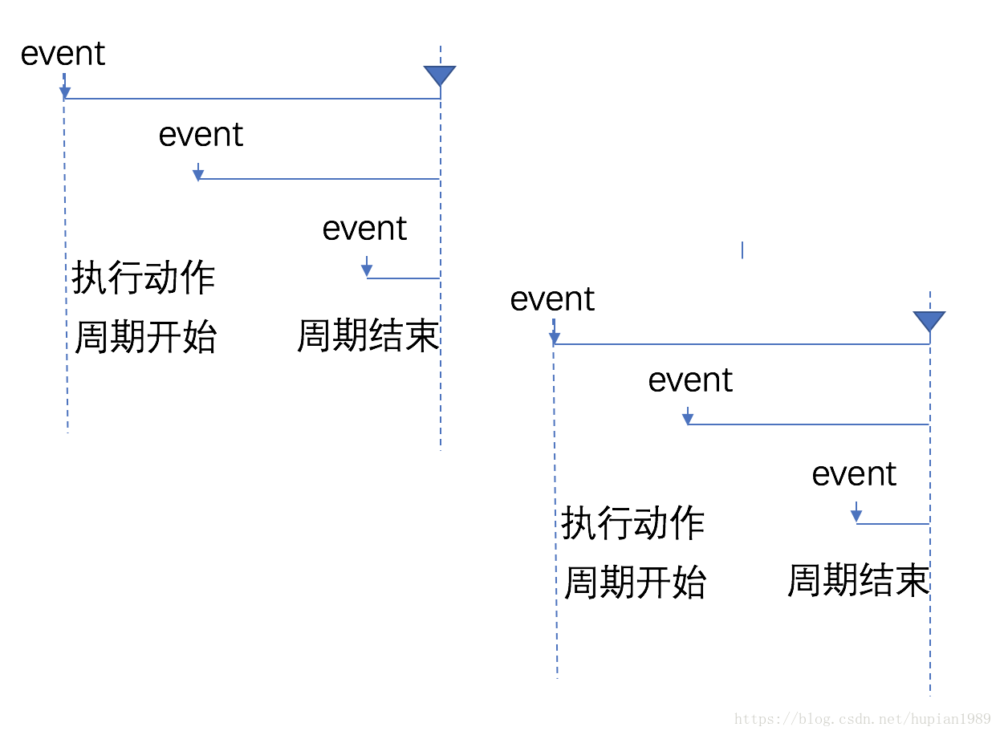

# JavaScript之函数（二）
## 函数防抖与节流
> 为了防止事件在短时间内被多次触发的两种解决方案
### 函数防抖与节流的意义
> 在绑定 scroll 、resize 这类事件时，当它发生时，它被触发的频次非常高，间隔很近。如果事件中涉及到大量的位置计算、DOM 操作、元素重绘等工作且这些工作无法在下一个 scroll 事件触发前完成，就会造成浏览器掉帧。加之用户鼠标滚动往往是连续的，就会持续触发 scroll 事件导致掉帧扩大、浏览器 CPU 使用率增加、用户体验受到影响。  

简单说就是：事件触发太频繁，浏览器来不及处理，导致页面出现卡顿
### 函数防抖（debounce ）
> 规定函数至少间隔多久执行
* 函数执行一次后，在 n 秒内不能再次执行，否则将推迟函数执行
* 下一次函数调用将会清除上一次的定时器，并重新计时

**基本思想**：策略是当事件触发时，设定一个周期延迟执行动作，若期间又被触发，则重新设定周期，知道周期结束，执行动作

> 后期拓展出前缘debounce，即执行动作在前，然后设定周期，周期内有事件被触发，不执行动作，且周期重新设定

延迟debounce 示意图：
  
前缘debounce 示意图：
  

debounce的特点是当事件快速连续不断触发时，动作只会执行一次，但当触发有间断，且间断时间大于设定的延迟时间间隔时，动作就会被执行多次


例子 | 未使用函数防抖 | 使用函数防抖  
:---:| :---:|:---:
验证用户输入信息 | 用户每输入一个字符就进行一次验证 | 用户输入完成后进行验证
窗口大小发生变化时重新计算新窗口大小 | 窗口大小改变就计算一次大小 | 窗口大小改变完成后计算大小

> 实例：模拟验证用户输入信息
```html
验证用户信息：<input type="text" name="" id="username">
```
```javascript
var username = document.getElementById("username");
btn.addEventListener("keyup", fun)
function fun(){
  console.log(username.value)
}
```
* 每当用户在输入框输入一个字符控制台就会输出，这种不仅从资源上来说是很浪费的行为，而且实际应用中，用户也是输出完整的字符后才会进行验证信息
> **改进**：简单的防抖
```javascript
var username = document.getElementById("username");
function debounce(action, delay){
  let timer = null // 定时器变量
  return function(){
    let self = this
    args = arguments
    clearTimeout(timer) // 触发时先清理上一次的定时器，然后重新计时
    timer = setTimeout(function(){
      action.apply(self, args)
    }, delay) // 设置定时器
  }
}
// 事件处理函数
function fun(){
  console.log(username.value)
}
username.addEventListener("keyup", debounce(fun, 500)) // 触发事件500毫秒后执行
```
### 函数节流（throttling）
> 规定函数在某段时间内最多执行一次
* 函数在n秒内最多执行一次
* 下一次函数调用将清除上一次的定时器  
  * 若函数执行的时间间隔小于等于规定时间间隔，用setTimeout在规定时间后再执行  
  * 若函数执行的时间间隔大于规定时间间隔则执行函数，并重新计时

**基本思想**：策略是固定周期内，只执行一次动作，若有新事件触发，不执行。周期结束后，又有事件触发，开始新的周期。  
节流策略也分为前缘和延迟两种。
* 延迟是指周期结束后执行动作  
* 前缘是指执行动作后再开始周期.

延迟throttling 示意图


前缘throttling 示意图


throttling的特点在连续高频触发事件时，动作会被定期执行，响应平滑

例子 | 未使用函数节流 | 使用函数节流
:---:| :---:|:---:
页面滚动图片懒加载 | 每次都会执行事件处理程序	| 指定事件处理程序的执行频率
 
```javascript
function throttle(func, interval){
  let timer = null
  let startTime = new Date()
  return function(){
    clearTimeout(timer)
    let curTime = new Date()
    if(curTime - startTime <= interval){
      //小于规定事件间隔，用setTimeout在指定时间后再执行
      timeout = setTimeout(() => {
        func()
      }, interval)
    }else {
      //重新计时并执行函数
      startTime = curTime
      func()
    }
  }
}
//事件处理函数
function realFunc(){
  console.log("success")
}
window.addEventListener('scroll', throttle(realFunc, 100))
```

### 函数防抖与函数节流的对比
> 不管是函数防抖还是函数节流，减少的都是事件处理程序的调用频率，而不是事件的调用频率。如上面的例子，每一次滚动，每一次输入都会触发事件

函数防抖和函数节流都用了闭包封装  
何时使用函数防抖，函数节流需要看需求：
* 当只需要处理最后一次触发事件时，用函数防抖。如窗口大小值变化时并不需要计算中间变化的过程，只需要窗口大小改变完成后的值
* 当事件触发过于频繁，需要限制事件处理程序的调用频率时，用函数节流